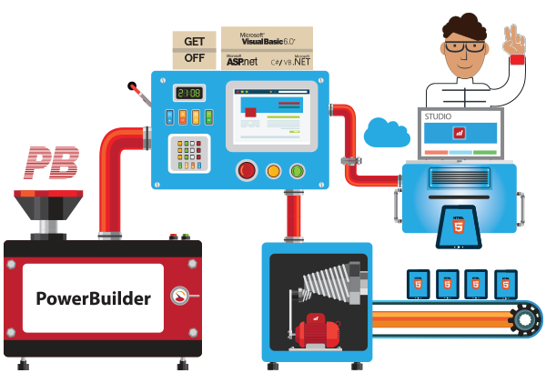

# Powerbuilder Migration

Mobilize.Net's automated migration tools convert PowerBuilder apps to modern web architecture and languages.

AI-assisted migration tools reduce time, cost, and risk compared to rewriting your apps from scratch. Move from 90s legacy to modern languages and platforms like Java Spring MVC, ASP.NET Core, Angular, JSON, and more.

Keep your proven business logic intact, reduce your defect rate, and get to market with a SaaS version quickly.

# Links

- [Mobilize.Net Powerbuilder Product Page](https://www.mobilize.net/powerbuilder)
- [Mobilize.Net Powerbuilder to Java Docs](https://docs.mobilize.net/PBJava)
- [Mobilize.Net Powerbuilder HelloWorld Sample](https://github.com/MobilizeNet/PBMapJavaHelloWorldPB)
- [Mobilize.Net Powerbuilder to Java HelloWorld Sample App](https://github.com/MobilizeNet/PBMAPJavaHelloWorld)
